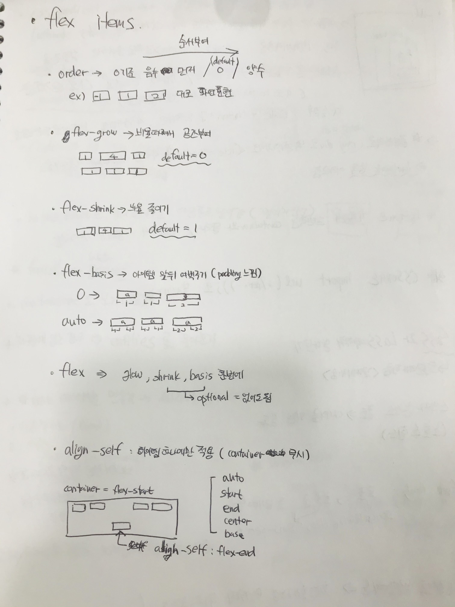
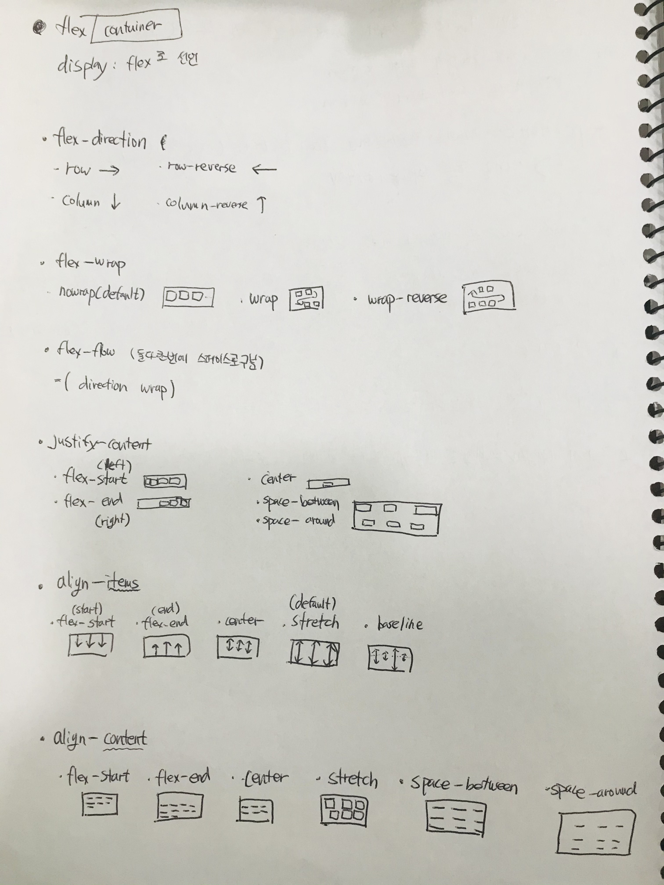

2021-02-23
# Float
- float은 css상에서 요소의 위치를 공중에띄움으로써 html만으로는 불가능했던 layout을 가능하게한다.
- 비슷한 방법으로 position과 flex가있다.(후에 다시언급)
    - 일반적인 배열을 normal flow(가로)라고 하며, 이 속성값들을 사용하면 커스터마이징이 가능하다.
- 자식요소가 float 되면 부모요소는 원래 가졌던 자식요소의 높이를 잃어버린다.
    - layout불군형을 방지하려면 가상소요인::after / clear:both / 부모에 고정크기부여 등 html과 css를 다양한방법을 사용할 수 있다.

## 2중 Float
- float 하려는 요소를 wrap하여 묶은후, wrap을 한번 더 float하는 방법.
- 2중 float은 1/2/3 3/2/1 같은 배열이 아닌 2/1/3 식의 불규칙 배열을 만들수있다.
    - 1과2를 left로 float한 후 wrap해서 다시 left로 float 하는 방식.
---
# Box-sizing
- 박스 사이징은 박스의 크기설정에 중요한 차이가있다.
- content box = 크기에 margin padding이 모두 포함
- border box = 크기에 padding이 포함
- 이것이 중요한이유는 박스의 속성에따라 총 width를 부여할때 margin이나 padding값을 고려함으로써 예상치못한 oversize가 되는것을 막을수 있기떄문이다.
---

# Flex
- float처럼 normal flow를 벗어난 layout 설정에 편리하다.
- flex 는 부모요소를 flex설정시 -> 부모는 flex container / 자식은 flex item 으로 지정한다.
- 각각 container와 item에 사용가능한 속성값이 다르므로 숙지해야한다.
    -[CSS TRICKS FLEX](https://css-tricks.com/snippets/css/a-guide-to-flexbox/)

